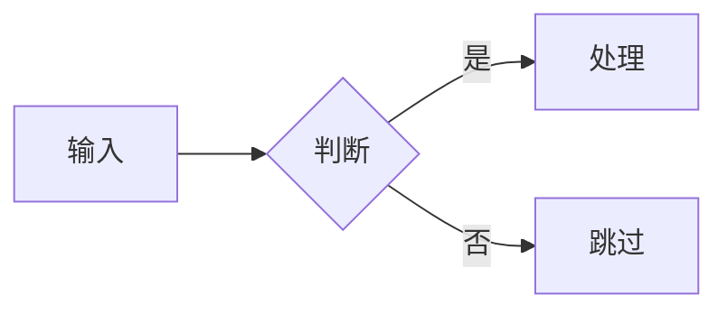

---
# Slidev headmatter:整份演示的全局配置(只在第一页 frontmatter 生效)
theme: default            # 主题:v52 起 default 也是独立包(脚本会自动装);换主题改这里(如 seriph / @slidev/theme-seriph)
title: 演示标题            # 浏览器标签与导出文件名
info: |
  ## 演示标题
  一句话副标题 / 作者 / 场合
transition: slide-left    # 全局切页动画:slide-left / fade / slide-up ...
class: text-center        # 给每页根元素加的 class(UnoCSS 原子类)
# mdc: true               # MDC 行内语法({.class} 等)。默认不开:开了之后 `:Word`(冒号紧跟单词)会被当内联组件吞掉文字。确需 MDC 时再取消注释
---

# 演示标题

一句话副标题

<div class="pt-12 opacity-60 text-sm">
  作者 · 2026
</div>

<!--
这是演讲者备注:开场白写在这里,只在演讲者模式可见。
-->

---
layout: default
---

# 核心要点

<v-clicks>

- 第一点:逐条点击出现
- 第二点:配合讲解节奏
- 第三点:一页聚焦一个主题

</v-clicks>

<!--
v-clicks 让列表逐项出现;按空格/方向键推进。
-->

---

# 代码示例

行高亮用 `{2,4-6}`,聚焦关键行:

```ts {2,4-6}
function greet(name: string) {
  const message = `Hi, ${name}`   // 高亮:核心逻辑
  return message
}

const out = greet('Slidev')       // 高亮:调用
console.log(out)                  // 高亮:输出
```

<!--
代码块基于 Shiki 高亮;`{all}` 全亮、`{1|2|3}` 配合点击逐行聚焦。
-->

---
layout: two-cols
---

# 图示

用文字描述生成流程图(Mermaid):



::right::

# 公式

行间公式用 `$$`(KaTeX):

$$
E = mc^2
$$

<!--
左右分栏:two-cols + ::right:: 分隔。Mermaid 与 LaTeX 均内置支持。
-->

---
layout: end
class: text-center
---

# 谢谢

[sli.dev](https://sli.dev)

<!--
结尾页:layout: end。也可用 center 居中。
-->
