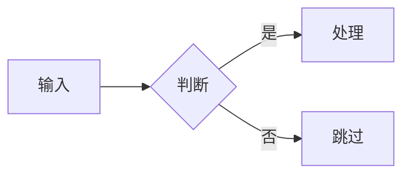

---
# Slidev headmatter:整份演示的全局配置(只在第一页 frontmatter 生效)
theme: seriph             # 衬线·深色极简(参考 trellis-lake 风格)
colorSchema: dark         # 强制深色:近黑底 + 衬线标题,投影更稳;改 light 即亮色
title: 演示标题            # 浏览器标签与导出文件名
info: |
  ## 演示标题
  一句话副标题 · 作者 · 场合
transition: slide-left    # 全局切页动画
# mdc: true               # 默认不开:开了之后「冒号紧跟单词」会被当 MDC 组件吞掉文字
---

# 演示标题

一句话副标题:讲清这套演示的核心主张

<div class="pt-12 text-sm opacity-60">
  补充信息 · 适用范围 · 作者 / 2026
</div>

<div class="abs-br m-6 text-sm opacity-50">
  按 <kbd>空格</kbd> 开始 &rarr;
</div>

<!--
开场白写这里(演讲者备注,仅演讲者模式可见)。
-->

---
layout: section
---

# 第一部分:章节标题

<!-- section 分隔页:衬线大标题,用于章节切换;seriph 下呈低饱和强调色 -->

---

# 核心要点

一句话点题,再用列表逐条展开:

<v-clicks>

- 第一点:逐条点击出现,配合讲解节奏
- 第二点:一页聚焦一个主题
- 第三点:正文给要点,不堆段落

</v-clicks>

<!--
v-clicks 让列表逐项出现;按空格 / 方向键推进。
-->

---

# 代码示例

行高亮用 `{2,4-6}` 聚焦关键行:

```ts {2,4-6}
function greet(name: string) {
  const message = `Hi, ${name}`   // 高亮:核心逻辑
  return message
}

const out = greet('Slidev')       // 高亮:调用
console.log(out)                  // 高亮:输出
```

<!--
代码块基于 Shiki 高亮;`{all}` 全亮、`{1|2|3}` 配合点击逐行聚焦。
-->

---
layout: two-cols
---

# 图示

用文字描述生成流程图(Mermaid):



::right::

# 公式

行间公式用 `$$`(KaTeX):

$$
E = mc^2
$$

<!--
左右分栏:two-cols + ::right:: 分隔。Mermaid 与 LaTeX 均内置支持。
-->

---
layout: center
class: text-center
---

# 谢谢

[sli.dev](https://sli.dev)

<!--
结尾页:center 居中;也可用 layout: end。
-->
